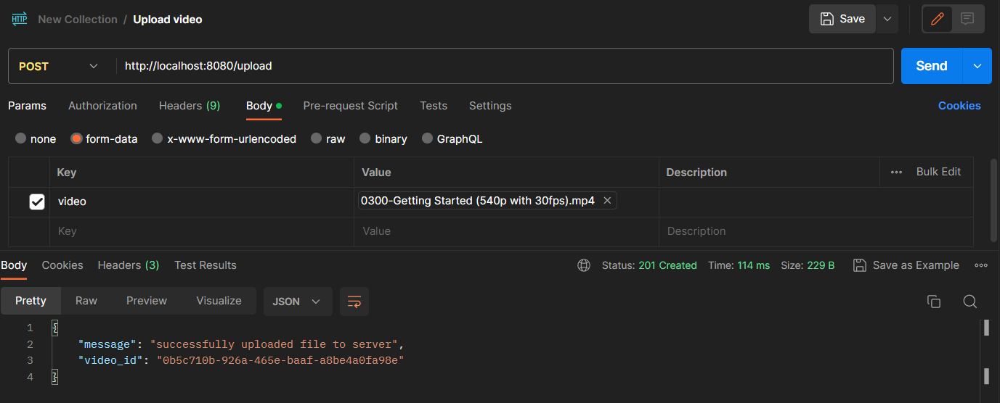

# Video Streaming using Go, HLS and ffmpeg

This is a simple video streaming project written in Go. It uses `ffmpeg` for converting video files into playlists (small chunks). Streaming happens with the help of `HLS`. `Gin Framework` is used for handling http requests.

## Try it out

### Pre-requisites
1. `Go` installed on your device [Download link](go.dev/doc/install)
2. `ffmpeg` installed on your device [Download link](ffmpeg.org/download.html)
3.  `VLC` or any other video player which supports HLS [Download Link](videolan.org/vlc)
4.  `Postman` or any other tool which allows to send http requests [Download Link](postman.com/downloads)

### Installation

#### Clone the repository
```shell
git clone https://github.com/amalmadhu06/video-streamer-go.git
```

#### Change to project directory
```shell
cd video-streamer-go
```

#### Install dependencies
```shell
go mod download
```

#### Start server
```shell
go run cmd/main.go
```
The server will be running at `http://localhost:8080`

| Functionality | Endpoint                       |
|---------------|--------------------------------|
| Upload video  | /upload                        |
| Stream video  | /play/{video_id}/playlist.m3u8 |

### Upload Video
Send a POST request to /upload endpoint with the video file as video form data. The server will store the video in the storage folder and generate a unique video_id. The response will include the video_id that can be used to stream the video.




### Stream Video
To stream a video, use the generated video_id and the playlist name. Send a GET request to /play/{video_id}/playlist.m3u8 endpoint. The server will respond with the HLS playlist data, and the client can play the video using HLS-compatible players.
Here I'm using `VLC Media Player`.

1. Open VLC Media Player 
2. Go to `Media Tab`
3. Select `Open Network Stream`
4. In the Network tab, paste the url in following format and click Play
```http
http://localhost:8080/play/{video_id}/playlist.m3u8
```

Example
```
http://localhost:8080/play/dc666bf7-b769-4406-b802-e7fb596fbf36/playlist.m3u8
```


That's it ! 